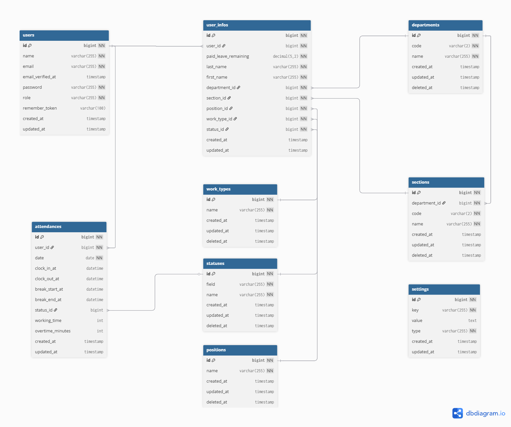
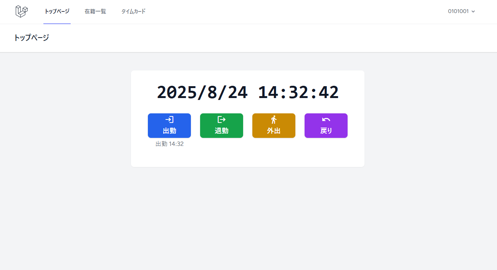
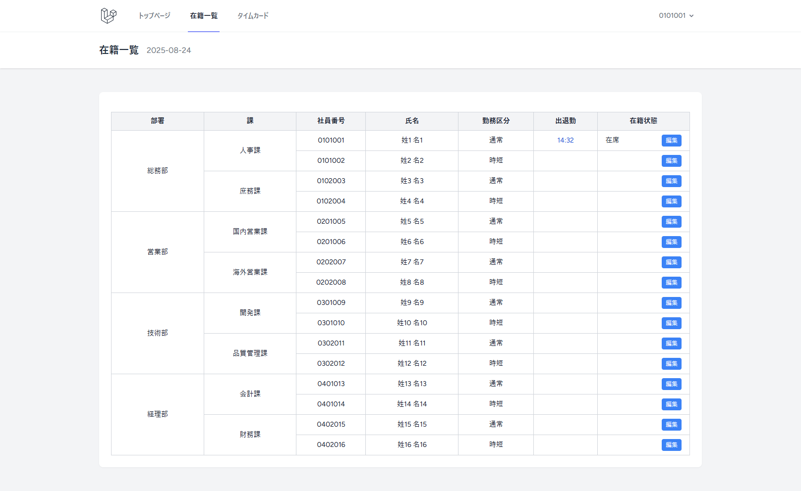
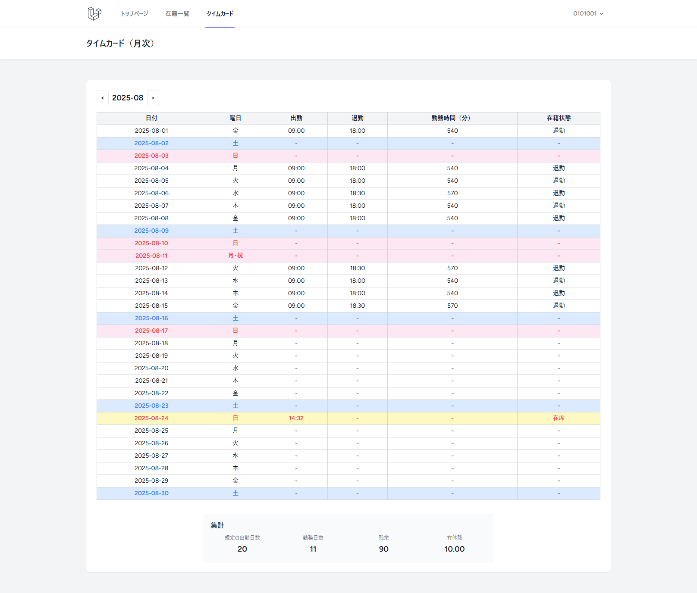
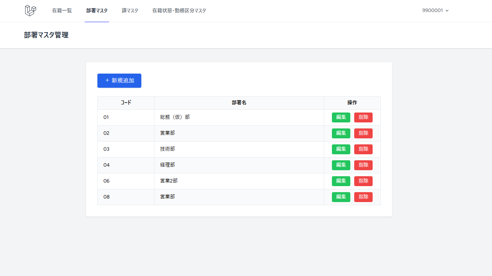
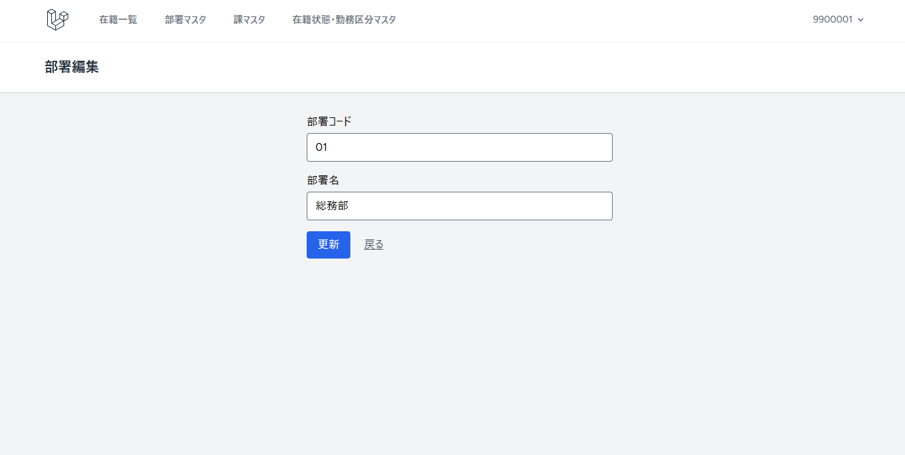

# 勤怠管理システム（Laravel 11／ポートフォリオ用）

## 概要

このプロジェクトは、実務を想定した勤怠管理システムです。  
部署・課・ユーザー・勤怠・在籍状態・勤務区分など、複数テーブルのリレーションを活かした本格的な業務ロジックを実装しています。  
管理者・一般ユーザーの権限分岐やマスタ管理、勤怠集計・残業・有休管理など、現場で求められる機能を網羅しています。

---

## デモ環境

- [デモサイトはこちら](http://os3-296-37806.vs.sakura.ne.jp/login)

### ログイン情報（デモ用）

- Basic認証
  - ID:applight
  - パスワード:JsNaPWGw4fYf

- 管理者ユーザー  
  - ID（社員番号）: `9900001`  
  - パスワード: `SkwD9TSF`

- 一般ユーザー  
  - ID（社員番号）: `0101001`  
  - パスワード: `01010010101001`
 
  ※パスワードはIDを2回繰り返したものになります。

  　在籍一覧に記載されている社員番号を使用してもログイン可能です。

---

## 主な機能

- **ユーザー認証・権限管理**（管理者/一般ユーザー）
- **勤怠打刻（出勤・退勤・外出・戻り）**
- **勤怠集計（勤務日数・残業・有休残数）**
- **部署・課・在籍状態・勤務区分などのマスタ管理（管理者専用画面）**
- **在籍一覧・編集機能**
- **管理者用ナビゲーション切替**
- **Seederによるダミーデータ投入**
- **レスポンシブ対応UI（Tailwind CSS）**

---

## 技術スタック

- Laravel 11
- Laravel Breeze
- MySQL
- Blade（テンプレート）
- Tailwind CSS
- Axios, Alpine.js
- Docker（devcontainer対応）

---

## ER図
[ER図（PDF）はこちら](docs/er_diagram.pdf)


---

## セットアップ手順

1. リポジトリをクローン
    ```sh
    git clone https://github.com/nekoguard/attendance.git
    cd <プロジェクトディレクトリ>
    ```
    ※ドキュメントルートを「/public」に変更してください。

2. `.env`ファイルを作成し、DB接続等を設定

3. 依存パッケージをインストール
    ```sh
    composer install
    npm install
    npm run build
    ```

    node.jsはこちらのバージョンを使用しています。
    ```sh
    curl -fsSL https://rpm.nodesource.com/setup_18.x | bash
    sudo dnf install -y nodejs --allowerasing
    ```

4. APP KEYを生成
    ```sh
    php artisan key:generate
    ```

5. マイグレーション・シーディング
    ```sh
    php artisan migrate:fresh --seed
    ```

---

## デモ画像







---

## 工夫・アピールポイント

- **リレーションを活かした集計・判定・マスタ管理**
- **Blade/Controller/Seeder/JSの役割分担と保守性**
- **管理者/一般ユーザーの権限分岐・ナビゲーション切替**
- **実務を意識したUI/UX・マスタ管理・ダミーデータ投入**
- **セキュリティ（CSRF/XSS/SQLi対策、認証・認可）**

---

## ライセンス

MIT

---

## 補足

- `.env`やシークレット情報は含めていません。必要に応じてご自身で作成してください。
- ご質問・ご要望はIssueまたはPRでお気軽にお問い合わせください。
